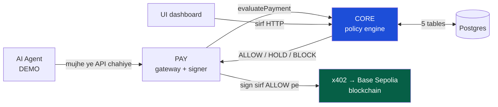
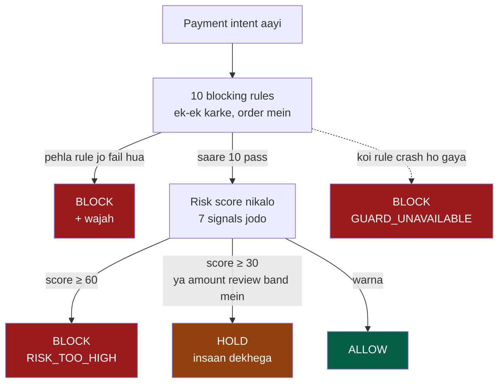
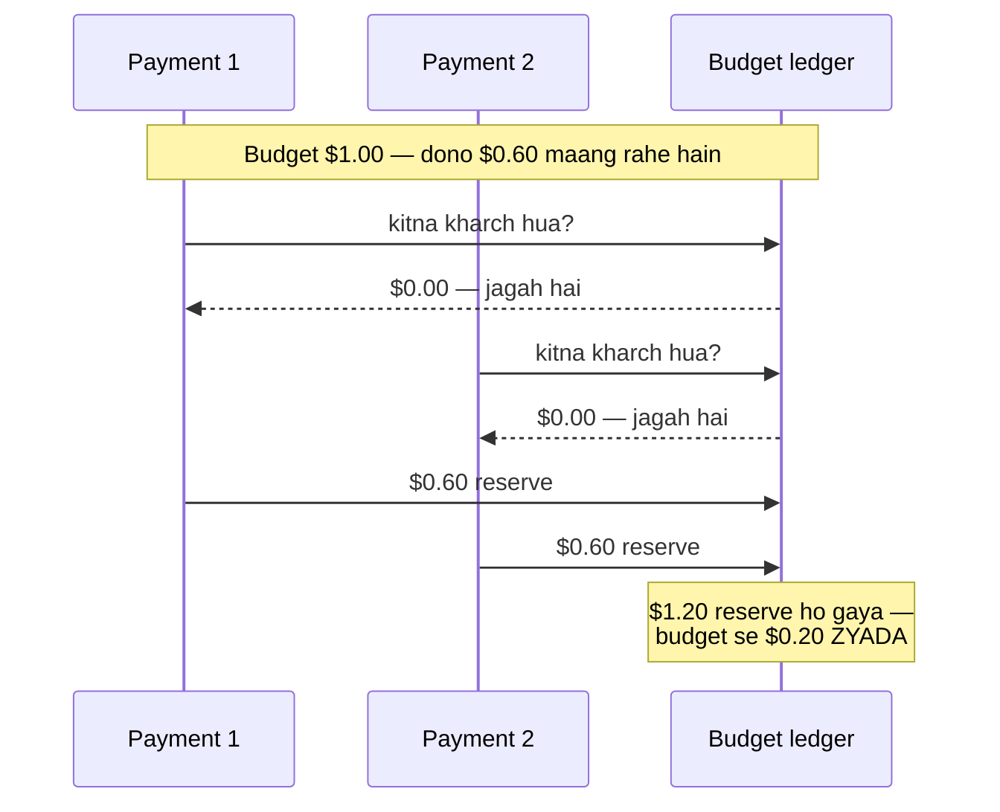
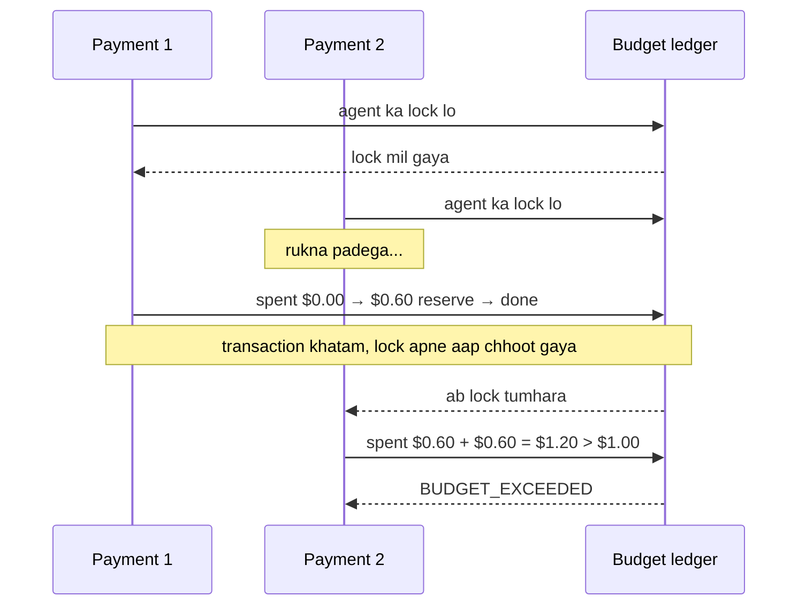
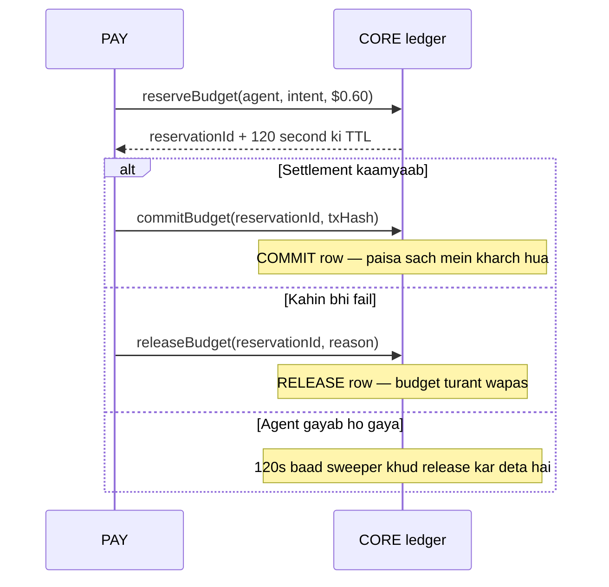
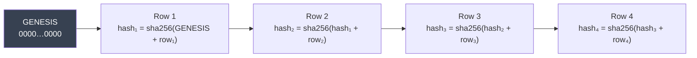
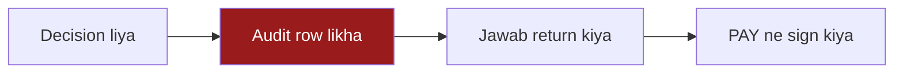

# CORE — Guard ka dimaag

> **Ek line mein:** CORE ek hi sawaal ka jawab deta hai, har baar same tareeke se, 60ms ke andar —
> *"Kya is agent ko ye payment karne deni chahiye?"* — aur phir us jawab ko aise likh deta hai ki
> baad mein koi mukar na sake.

Ye document CORE division ka poora kaam explain karta hai. Team ke kisi bhi member ke liye — chahe
woh PAY, UI ya DEMO pe kaam kar raha ho.

---

## 1. CORE karta kya hai

Teen cheezein, aur ye teeno sirf yahin hain:

| # | Cheez | Matlab |
|---|---|---|
| 1 | **The Decision** | Ek pure function: `evaluate(context) → ALLOW / HOLD / BLOCK` + reasons |
| 2 | **The Money** | Reserve/commit/release ledger jise race karke overspend nahi kiya ja sakta |
| 3 | **The Record** | Append-only, hash-chained audit log — signing se *pehle* likha jaata hai |

### Sabse zaroori rule

> **Engine ke andar koi LLM nahi, koi randomness nahi, koi network call nahi, koi `Date.now()` nahi.**

Same `(intent, policy, counters)` hamesha same decision de — warna product auditable nahi rehta aur
poora security claim gir jaata hai. Time bhi bahar se inject hota hai (`ctx.now`), taaki test mein
kal ka time daal ke bhi wahi jawab aaye.

---

## 2. CORE poore system mein kahan hai



**Dhyan dene layak baat:** agent ke paas kabhi private key nahi hoti. Signer PAY ke paas hai, aur PAY
tab tak sign nahi karta jab tak CORE `ALLOW` na bole. Isliye blocked payment blockchain tak
pahunchti hi nahi.

---

## 3. The Decision — faisla kaise hota hai

### Poora flow



**Do baatein yahan important hain:**

1. **Pehla failure jeetta hai.** Rules order mein chalte hain. Agar rule 3 fail hua to rule 8 check
   hi nahi hota. Isse har BLOCK ki ek hi, saaf wajah hoti hai.
2. **Crash bhi BLOCK hai.** Dotted line dekho — agar koi rule exception phenke, DB mar jaye, ya
   policy hi na mile, jawab phir bhi BLOCK aata hai. **Error kabhi ALLOW nahi ban sakta.**

### 10 blocking rules (precedence order mein)

| # | Rule | Fail hone pe | Simple bhasha |
|---|---|---|---|
| 1 | Agent ACTIVE hai? | `AGENT_FROZEN` | Frozen agent kuch kharch nahi kar sakta |
| 2 | Network + asset allowed? | `NETWORK_NOT_ALLOWED` / `ASSET_NOT_ALLOWED` | Sirf approved chain aur coin |
| 3 | Merchant blocklist pe to nahi? | `MERCHANT_BLOCKED` | Banned dukaan |
| 4 | Merchant allowlist pe hai? | `MERCHANT_NOT_ALLOWLISTED` | Anjaan dukaan → BLOCK ya HOLD (policy decide karti hai) |
| 5 | payTo wahi hai jo pin kiya tha? | `RECIPIENT_MISMATCH` | Paisa sahi wallet mein hi jaye |
| 6 | Amount per-transaction limit ke andar? | `PER_TRANSACTION_LIMIT_EXCEEDED` | Ek payment ki max limit |
| 7 | Amount absolute ceiling ke andar? | `ABSOLUTE_BLOCK_THRESHOLD` | Hard stop |
| 8 | Hour/day/month budget mein jagah hai? | `BUDGET_EXCEEDED` | Teen alag budget windows |
| 9 | Velocity limit ke andar? | `VELOCITY_EXCEEDED` | Kitni tez payments ho rahi hain |
| 10 | Wallet mein allowance bachi hai? | `ALLOWANCE_EXHAUSTED` | Wallet khud kitna de sakta hai |

Har rule ek **pure function** hai: `(context) => Reason | null`. `null` matlab pass. Koi DB, koi
clock, kuch nahi — ESLint build hi fail kar deta hai agar koi yahan DB import kare.

### Risk score — 7 signals

Rules pass ho gaye, ab sawaal hai *"kitna shanka hai?"* Har signal ek haan/naa sawaal hai:

| Signal | Points | Kab lagta hai |
|---|---:|---|
| `unknown_merchant` | 40 | Merchant ka koi record nahi |
| `recipient_not_pinned` | 30 | Is merchant ka wallet pin nahi kiya gaya |
| `over_half_remaining_daily_budget` | 25 | Aaj ka bacha budget, uska aadhe se zyada ek hi payment mein |
| `blocked_attempts_recent` | 25 | Pichle 5 min mein koi payment block hui |
| `over_5x_median_amount` | 20 | Normal se 5 guna bada amount |
| `velocity_near_limit` | 15 | Kisi velocity limit ke 80% pe |
| `first_payment_by_agent` | 10 | Agent ki pehli hi payment |

Jo signals lage unke points jod do, 0–100 pe cap kar do. **Ye model nahi hai — ye addition hai.**

Aur function sirf number nahi, **poori list** return karta hai. Judge poochhega *"71 hi kyu?"* —
jawab screen pe hoga: `unknown_merchant +40, blocked_attempts +25, ... = 65`.

---

## 4. The Money — budget race-proof kaise banaya

### Problem: do payments ek saath aa jayen to?

Budget `$1.00`, do payments dono `$0.60` maang rahi hain. Bina protection ke:



Dono ne "jagah hai" padha *isse pehle* ki koi likhta. Classic race condition.

### Solution: per-agent advisory lock



Lock **sabse pehle** liya jaata hai — padhne se bhi pehle. Aur ye **per-agent** hai, global nahi,
to alag-alag agents ek doosre ko slow nahi karte.

### Reservation ka poora lifecycle



Hisaab bilkul simple rehta hai:

```
spent    = SUM(COMMIT)
reserved = SUM(RESERVE) − SUM(COMMIT) − SUM(RELEASE)
```

Commit aur release apne aap zero ho jaate hain, isliye "reserved" mein sirf **zinda** reservations
bachti hain.

---

## 5. The Record — audit log jisme cheating nahi ho sakti

Har audit row apne se pehli row ka hash apne andar rakhti hai:



Agar koi Row 2 ko chupke se badal de, to `hash₂` badal jaata hai — aur uske baad **har row ka hash
galat ho jaata hai**. `GET /api/v1/audit/verify` poori chain dobara compute karke exact row bata
deta hai jahan tampering hui.

**Sabse important baat — order:**



Audit row **return se pehle** likhi jaati hai. Matlab aisi koi payment ho hi nahi sakti jo sign hui
ho par record na ho.

---

## 6. Bahar se kya milta hai

### PAY ke liye — sirf 4 functions

```ts
import { evaluatePayment, reserveBudget, commitBudget, releaseBudget } from "@/core";
```

Bas. Iske alawa kuch bhi boundary cross nahi karta.

### UI ke liye — HTTP endpoints

| Endpoint | Kaam |
|---|---|
| `GET /api/v1/transactions` | Saari payments + summary |
| `GET /api/v1/transactions/:id` | Ek payment ki poori kahani + ledger + audit |
| `GET /api/v1/metrics/summary` | Dashboard ke numbers |
| `GET /api/v1/agents` · `/:id` | Agent list aur detail |
| `POST /api/v1/agents/:id/freeze` | **Kill switch** — agli payment se hi effective |
| `POST /api/v1/payments/evaluate` | Asli decision endpoint |
| `GET/POST/PUT /api/v1/policies/*` | Policy versions + diff |
| `POST /api/v1/policies/:id/simulate` | "Ye policy pehle hoti to kya hota?" |
| `GET /api/v1/approvals` + approve/reject | HOLD queue |
| `GET /api/v1/budgets/:agentId` | Budget kitna bhara hai |
| `GET /api/v1/audit` · `/audit/verify` | Audit trail + tamper check |
| `GET /api/v1/events/stream` | Live updates (SSE) |

**Har response ek hi shape mein aata hai:**

```json
{ "status": true,  "statusCode": 200, "data": { } }
{ "status": false, "statusCode": 402, "message": "…", "error": { "code": "…", "details": { } } }
```

Aur **paisa hamesha decimal string** hota hai (`"2.00"`), kabhi number nahi — warna floating point
error paise mein aa jaata hai.

---

## 7. Proof — kya sach mein kaam karta hai

### Test numbers

| Cheez | Result |
|---|---|
| Total tests | **199 passing, 0 pending** |
| Engine latency (p95) | **0.055 ms** — target 60 ms tha |
| 50 concurrent payments vs $1.00 budget | **exactly 1 ALLOW**, 5 baar chala ke |
| Audit chain verify | **valid, 79 rows** |
| Lint / typecheck (core) | **0 errors** |

### Live server pe chala ke dekha

```
no key              → 503  GUARD_UNAVAILABLE
$0.02 clean         → 200  ALLOW + reservationId
$2.00               → 402  PER_TRANSACTION_LIMIT_EXCEEDED
rogue.example.com   → 402  MERCHANT_BLOCKED
galat payee         → 402  RECIPIENT_MISMATCH
$0.45               → 202  HOLD
freeze → payment    → 403  AGENT_FROZEN
```

### Aur ye number — poora product isi pe judge hoga

```
blockedUsd:              $2,009.58
blockedOnChainTxCount:   0
```

**$2,009 rok diya gaya. Blockchain pe ek bhi koshish ka nishaan nahi.**

---

## 8. Raaste mein jo bugs pakde

Ye section isliye hai kyunki inme se koi bhi demo ke din phat sakta tha.

### 🔴 Concurrency test jhoota tha

Test likhne ke baad maine **lock hata ke** test chalaya — test phir bhi **pass** ho gaya.

Wajah: connection pool sirf 5 ka tha aur `reserveBudget` itna fast hai (~1ms) ki do payments kabhi
overlap hi nahi karti thi. Measure kiya to pata chala 50 "concurrent" calls mein sirf **2** actually
saath chal rahi thi.

Window chauda karke test kiya:

```
lock nahi, delay nahi   →  1 success   $0.60 reserved   ✅ within budget
lock nahi, 50ms window  →  5 success   $3.00 reserved   ❌ OVERSPENT
lock hai,  50ms window  →  1 success   $0.60 reserved   ✅ within budget
```

Ab test mein **do negative control** hain, jisme ek seedha check karta hai ki `reserveBudget` lock
leta hai ya nahi — dusri connection se lock pakad ke dekha jaata hai ki woh rukta hai ya nahi.

### 🔴 Approvals queue kabhi bharti hi nahi

Policy mein `maxPerTransactionUsd = $0.10` tha, par review band `$0.10 – $1.00`. Matlab **poora
review band rule 6 ke peeche chhupa hua tha** — $0.10 se upar ka har amount pehle hi block ho jaata,
HOLD tak pahunchta hi nahi. Ek pura product feature dead code tha.

Fix ke baad seeded 40 payments ka replay: **38/40 → 40/40** decisions match karti hain.

### 🔴 Audit chain hamesha "invalid" bolta

```sql
select seq::text as seq … order by seq desc   -- "9" > "40" (text comparison!)
```

Postgres mein `ORDER BY` pehle output alias dekhta hai. Isse do cheezein toot rahi thi — naya audit
row likhna fail ho raha tha, aur `verifyChain` bilkul sahi chain ko bhi galat bata raha tha.

### 🟡 Transaction list galat order mein

ULID time-sortable hote hain, par seed ids **abhi** banati hai aur timestamps **backdate** karti
hai. Fix: `(created_at, id)` pe proper keyset pagination.

### 🟡 Policy ke numbers do jagah, aur woh aapas mein match nahi karte the

DataBot ki policy columns kehte the "3 tx/min", par JSON kehta tha "10" — aur engine JSON padhta
hai. Yani UI kuch aur dikhati, enforce kuch aur hota.

---

## 9. Jo abhi baaki hai (honest list)

| Cheez | Kya | Kiska |
|---|---|---|
| Dashboard auth | `ASPG_ADMIN_TOKEN` set nahi hai to sab ADMIN hain. Local demo ke liye theek, **deploy se pehle set karna zaroori** | CORE |
| PAY ke 4 call sites | Mock ab asli API se match karta hai, to PAY ko 4 lines badalni hain (blocker B7) | PAY |
| Rule 7 shadowed | `maxPerTransaction == blockAbove` hone se rule 7 kabhi fire nahi hoga. Dono taraf BLOCK hi milta hai, to demo safe hai | decision pending |
| Seed ka timeline | Seed `2026-08-13` pe fix hai. Demo se pehle fresh `db:seed` chala lena | CORE |

---

## 10. Khud chala ke dekhna ho to

```bash
# setup
cp .env .env.local
npm run db:push && npm run db:seed

# saare tests
npm test

# engine ki speed
npm run bench

# saari read queries DB ke against
npx tsx --env-file=.env.local src/core/scripts/check-queries.ts

# server
npm run dev
curl -s localhost:3000/api/v1/metrics/summary?window=720
curl -s localhost:3000/api/v1/audit/verify
```

Blocked payment khud try karke dekho:

```bash
curl -s -X POST localhost:3000/api/v1/payments/evaluate \
  -H "Content-Type: application/json" \
  -H "X-Guard-Key: gk_live_researchbot_demo" \
  -d '{"amountUsd":"2.00","asset":"USDC","network":"base-sepolia",
       "recipient":"0x9a2B4c6D8e0F1a3B5c7D9e1F2a4B6c8D0e2F4a6B",
       "merchant":"localhost:3000","resource":"POST /api/sandbox/premium-report"}'
```

---

## Ek line mein poori kahani

> Agent ne $2 kharch karne ki koshish ki. Guard ne mana kar diya.
> Blockchain ko us koshish ka pata bhi nahi chala.
> Aur audit log sabit kar deta hai ki ye hua tha.
