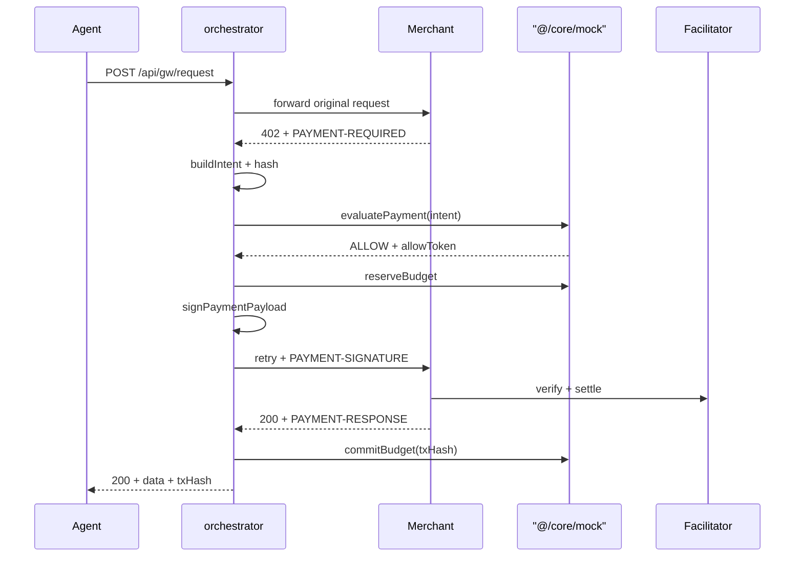

# 🟥 PAY — build checklist

Read [README.md](./README.md) once for context. **This file is your order of work.** One checkpoint =
one commit. Never start C(n+1) before C(n) is green.

| | |
|---|---|
| **Branch** | `pay/<slice>` — e.g. `pay/x402-poc`, `pay/gateway` |
| **You own** | `src/payments/**` and `app/api/gw/**` |
| **You never touch** | `src/core/**`, `src/dashboard/**`, `src/demo/**`, `src/shared/types.ts` |
| **You depend on** | Nobody. `@/core/mock` already returns `ALLOW`, so you build the full flow on day 0. |
| **People waiting on you** | DEMO at C7 — they call your gateway over HTTP. |

---

## Before you start

```bash
git pull origin main
npm install
cp .env.example .env.local
npm install @x402/fetch @x402/evm @x402/next     # not installed yet — you add them
npm run typecheck
```

You also need, on day 0:

- A Base Sepolia wallet (`AGENT_WALLET_PRIVATE_KEY`, **testnet key only, never a real one**)
- Test ETH for gas and test USDC to spend
- `X402_FACILITATOR_URL=https://x402.org/facilitator`

---

## Commit convention

```
<type>(pay): C<n> <what changed>
```

Examples:

```
feat(pay): C1 proof of concept settles a real payment on Base Sepolia
feat(pay): C5 allowToken HMAC bound to intentHash, single use
test(pay): C5 signer refuses a tampered intent
```

Team-wide progress at a glance:

```bash
git log --all --oneline | grep -oE "\((core|pay|ui|demo)\): C[0-9]+" | sort -u
```

---

## Progress

Running record of what was actually built, decided and blocked: **[PROGRESS.md](./PROGRESS.md)**.

| | Checkpoint | Unblocks | Done |
|---|---|---|---|
| C1 | Real x402 payment settles | 🚨 the whole project | ☑ |
| C2 | Header codecs | C4 | ☑ |
| C3 | SDK adapter + facilitator types | C6 | ☑ |
| C4 | Intent build + hash | C5 | ☑ |
| C5 | allowToken + signer | C6 | ☐ |
| C6 | Gateway orchestrator | C7 | ☐ |
| C7 | `POST /api/gw/request` live | 🟧 **DEMO** | ☐ |

---

## C1 — Prove x402 works 🚨 do this first, before any product code

x402 is the only dependency the team does not control. If it has a surprise, everyone needs to know
in hour 4, not on submission night.

**Files.** `scripts/fund-wallet.ts`, `scripts/poc-x402.ts`

**Steps.**

1. Generate a Base Sepolia wallet, fund test ETH and test USDC.
2. `npm run wallet:fund` prints both balances.
3. Point `poc:x402` at any live x402 endpoint — DEMO's sandbox if it exists, otherwise a public one.
4. `npm run poc:x402` completes a real payment and prints a transaction hash.

**Done when.**

```bash
npm run poc:x402      # prints 0x... — open it on sepolia.basescan.org
```

**Also required:** write the *actual* header shapes you observed into `Docs/x402-notes.md`, and
**screenshot the BaseScan transaction** — it goes on PPT slide 4.

**Commit.** `feat(pay): C1 proof of concept settles a real payment on Base Sepolia`

> 🚨 If this is not green by hour 4, say so immediately. CORE pairs in; everyone else keeps working
> on mocks. Do not silently grind on it.

---

## C2 — Header codecs

**Goal.** Encode and decode the three protocol headers. They are base64-encoded JSON.

**Files.** `x402/headers.ts`, `tests/headers.test.ts`

**Contract.**

```ts
decodePaymentRequired(headerValue: string): PaymentRequirements
encodePaymentSignature(payload: PaymentPayload): string
decodePaymentResponse(headerValue: string): SettlementResult
```

**Hard rule.** These three headers are **protocol-defined and never wrapped in our API envelope**.
The envelope applies only to JSON bodies we author.

**Done when.** The tests decode the *real captures from C1*, not invented fixtures. A malformed
header returns `INVALID_PAYMENT_REQUIREMENTS`, never throws raw.

```bash
npm test -- headers
```

**Commit.** `feat(pay): C2 header codecs verified against real C1 captures`

---

## C3 — SDK adapter and facilitator

**Goal.** Confine `@x402/*` to one file.

**Files.** `x402/adapter.ts`, `x402/facilitator.ts`, `mock/index.ts`

**Hard rule.** `x402/adapter.ts` is **the only file in the repo allowed to `import "@x402/*"`.**
ESLint enforces it. If the SDK surface differs from the docs, exactly one file changes.

`mock/index.ts` gets a fake signer and fake facilitator so CORE and DEMO can run without a chain.

**Done when.** `npm run lint` passes and `poc:x402` still works when routed through the adapter.

**Commit.** `feat(pay): C3 x402 adapter confines the SDK to one file`

---

## C4 — Intent build and hash

**Goal.** `PAYMENT-REQUIRED` → canonical `PaymentIntent`.

**Files.** `intent/build.ts`, `intent/hash.ts`

**Contract.**

```ts
buildIntentFromRequirements(req: PaymentRequirements, ctx: { agentId, resource, reason }): PaymentIntent
computeIntentHash(intent: PaymentIntent): string
```

`merchant` is the request **hostname** — it is the allowlist key CORE matches on. `amountMinor` is
`bigint` via `toMinor` from `@/shared/money`. No floats anywhere near this file.

**Why the hash matters.** It binds the signer to exactly the fields that were approved. Without it,
an attacker swaps `payTo` between ALLOW and signing. That is threat T9.

**Done when.** A test proves the hash changes when any single field changes, and that key order in
the object does not change it.

**Commit.** `feat(pay): C4 canonical intent build and tamper-binding hash`

---

## C5 — allowToken and signer

**Goal.** The signer refuses to sign anything the Guard did not approve.

**Files.** `wallet/allowToken.ts`, `wallet/signer.ts`, `tests/signer.test.ts`

**Contract.**

```ts
mintAllowToken(intentHash: string): string     // HMAC, 60s TTL, single use
verifyAllowToken(token: string, intentHash: string): boolean
signPaymentPayload(intent: PaymentIntent, allowToken: string): Promise<PaymentPayload>
```

`signPaymentPayload` re-checks **every** field against the intent before signing, then verifies the
token, then marks the token used. Any mismatch throws — it never signs "close enough".

**Done when.** Three tests pass:

1. A valid token + matching intent signs.
2. A tampered `payTo` is refused.
3. Replaying the same token twice is refused.

```bash
npm test -- signer
```

**Commit.** `feat(pay): C5 allowToken HMAC and a signer that refuses tampered intents`

---

## C6 — Gateway orchestrator

**Goal.** The whole flow, end to end, still on the CORE mock.

**Files.** `gateway/forward.ts`, `gateway/orchestrator.ts`



**Import from CORE — this exact line, and only this line:**

```ts
import { evaluatePayment, reserveBudget, commitBudget, releaseBudget } from "@/core/mock";
```

**`forward.ts` strips** `X-Guard-*`, `Authorization` and every `PAYMENT-*` header before proxying.
An agent must not be able to smuggle its own payment header through.

**Every failure path releases the reservation.** Verify-fail, settle-fail, timeout, 402-on-retry,
merchant 500 — all of them call `releaseBudget`. A leaked reservation silently shrinks the budget
until someone restarts the app.

**Done when.** A test walks all five failure paths and asserts `releaseBudget` was called each time.

**Commit.** `feat(pay): C6 gateway orchestrator with reservation release on every failure path`

---

## C7 — `POST /api/gw/request` 🚨 unblocks DEMO

**Goal.** The public endpoint, and the swap to the real engine.

**File.** `handlers/gw-request.ts`

**Two changes at this checkpoint:**

1. Wire the handler.
2. When CORE announces C6 is merged, change one import: `@/core/mock` → `@/core`. Nothing else.

### Frozen contract — DEMO codes against this exact shape

**Request**

```http
POST /api/gw/request
X-Guard-Key: gk_live_researchbot_demo
Content-Type: application/json

{
  "url": "http://localhost:3000/api/sandbox/search",
  "method": "POST",
  "body": { "query": "x402 adoption" },
  "reason": "search for x402 adoption data",
  "idempotencyKey": "optional-string"
}
```

**Allowed and settled — `200`**

```json
{
  "status": true,
  "statusCode": 200,
  "data": {
    "intentId": "int_01J9...",
    "decision": "ALLOW",
    "amountUsd": "0.02",
    "merchant": "localhost:3000",
    "resource": "POST /api/sandbox/search",
    "onChain": {
      "signed": true,
      "txHash": "0xabc...",
      "explorerUrl": "https://sepolia.basescan.org/tx/0xabc..."
    },
    "response": { "results": [] }
  }
}
```

**Blocked — `402`, and `txHash` is `null`, always**

```json
{
  "status": false,
  "statusCode": 402,
  "message": "Transaction amount $2.00 exceeds the per-transaction limit of $0.10.",
  "error": {
    "code": "PER_TRANSACTION_LIMIT_EXCEEDED",
    "details": {
      "intentId": "int_01J9...",
      "requested": "2.00",
      "limit": "0.10",
      "onChain": { "signed": false, "txHash": null }
    }
  }
}
```

**Held — `202`**

```json
{
  "status": false,
  "statusCode": 202,
  "message": "Payment is awaiting human review.",
  "error": {
    "code": "APPROVAL_REQUIRED",
    "details": { "intentId": "int_01J9...", "expiresAt": "2026-08-13T09:15:00.000Z" }
  }
}
```

**Response must never contain** a private key, an RPC URL, a signer object or a raw facilitator
response. The agent gets a decision, a result and a hash. Nothing else.

**Done when.**

```bash
npm run dev
curl -s -X POST localhost:3000/api/gw/request \
  -H "X-Guard-Key: gk_live_researchbot_demo" -H "Content-Type: application/json" \
  -d '{"url":"http://localhost:3000/api/sandbox/search","method":"POST","body":{"query":"test"},"reason":"demo"}'
```

An allowed call returns a real `txHash`. A $2.00 call returns `402` with `"txHash": null` and
**nothing on BaseScan**.

**Commit.** `feat(pay): C7 guarded request endpoint wired to the real policy engine`

---

## Security rules you own

| Rule | Enforced in |
|---|---|
| The agent never receives a private key or RPC URL | `handlers/gw-request.ts` response shape |
| The signer refuses any payload differing from the approved intent | `wallet/signer.ts` |
| `allowToken` is single-use, 60 s TTL, bound to `intentHash` | `wallet/allowToken.ts` |
| Every failure path releases the reservation | `gateway/orchestrator.ts` |
| Blocked payments are never signed and never sent | `gateway/orchestrator.ts` |
| `429` rate limit is distinct from a policy `402 VELOCITY_EXCEEDED` | `handlers/gw-request.ts` |

---

## Frozen contracts — changing these breaks other people

| What | Who breaks | Protocol |
|---|---|---|
| `POST /api/gw/request` request/response shape | DEMO | announce in chat before changing |
| `src/payments/index.ts` exports | app routes | add deliberately, never remove |
| The import in the orchestrator | nothing — it is yours | swap `mock` → real at C7 |

You may not edit `src/shared/types.ts`. Need a field? Ask CORE in the group chat.
