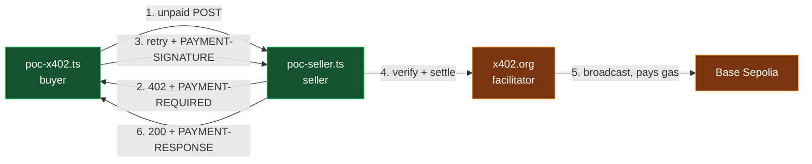

# 🟥 PAY — progress log

[BUILD.md](./BUILD.md) is the plan. **This file is the record** — what actually got built, what is
proven, what is still open. Update it at the end of every checkpoint.

Last updated: **2026-08-15** · Branch: `pay/x402-poc` · C1 ☑ C2 ☑ C3 ☑ C4 ☑ C5 ☑ · next: **C6**

---

## Status board

| C | Checkpoint | Status | Proven by |
|---|---|---|---|
| C1 | Real x402 payment settles | 🟢 **green** | tx `0x364612…4eda9` on Base Sepolia, buyer balance $20.00 → $19.99 |
| C2 | Header codecs | 🟢 **green** | 12 tests pass against the real C1 captures |
| C3 | SDK adapter + facilitator types | 🟢 **green** | 7 adapter tests + a real settlement through the split, tx `0x9e060e…8f15` |
| C4 | Intent build + hash | 🟢 **green** | 19 tests · hash moves on all 9 judged terms, ignores key order |
| C5 | allowToken + signer | 🟢 **green** | 10 tests · 3 mutation tests confirm each guard is load-bearing |
| C6 | Gateway orchestrator | ⚪ not started | |
| C7 | `POST /api/gw/request` live | ⚪ not started | 🟧 DEMO waits on this |

Legend: 🟢 green · 🟡 partly done · ⚪ not started · 🔴 blocked

---

## C1 — real x402 payment settles



Green = written and verified. Amber = code paths written, not yet exercised end to end.

### Files

| File | State |
|---|---|
| `scripts/fund-wallet.ts` | ✅ implemented · generates a key when unset, else prints address + USDC + ETH |
| `scripts/poc-seller.ts` | ✅ implemented · throwaway `$0.01` x402 seller |
| `app/api/gw/poc-seller/route.ts` | ✅ new · 7-line re-export |
| `scripts/poc-x402.ts` | ✅ implemented · buyer, captures raw headers, writes `Docs/x402-notes.md` |
| `src/shared/env.ts` | ✅ 1-line fix · `"0x..."` placeholder now reads as unset |
| `eslint.config.mjs` | ✅ `poc-*.ts` exempt from the `@x402/*` import ban |
| `package.json` | ✅ `@x402/fetch` `@x402/evm` `@x402/next` pinned at `2.22.0` |

### Verified

| Check | Result |
|---|---|
| `npm run build` | ✅ passes, `ƒ /api/gw/poc-seller` in the route list |
| `npm run typecheck` | ✅ clean |
| `npm run lint` | ✅ 0 errors |
| `npm run wallet:fund` | ✅ prints a fresh key when none is configured |
| `POST /api/gw/poc-seller` | ✅ real `402` + valid `PAYMENT-REQUIRED` header |

### Settlement — proven 2026-08-15

| | |
|---|---|
| txHash | `0x3646125c0277585492aba0139c08c43b4f6849362d93e4244397768d57a4eda9` |
| explorer | https://sepolia.basescan.org/tx/0x3646125c0277585492aba0139c08c43b4f6849362d93e4244397768d57a4eda9 |
| from → to | `0x0D3CaC…84ef` (agent) → `0x2de7B9…7Dc4` (merchant) |
| value | `10000` minor units = $0.01 USDC |
| buyer balance | $20.00 → **$19.99** |
| gas paid by | `0xd407e4…f1bf` — the facilitator's own signer, not the agent |

An earlier run (`0x164317…3c2b`) settled successfully but paid the agent's own address, because
`MERCHANT_WALLET_ADDRESS` in `.env.local` was set to the agent's address. Both runs are real
on-chain transactions; the second is the one to screenshot.

Still owed at C1: BaseScan screenshot for PPT slide 4.

🔧 **Action:** `.env.local` still has `MERCHANT_WALLET_ADDRESS` = the agent's own address. Set it to
`0x2de7B9388C249D20800bA097eD5DEb66e4437Dc4` (or DEMO's, when they publish one), or every future
run pays itself and the demo shows no movement.

### First real capture

The 402 header decodes to this. `amount` is integer minor units, `network` is CAIP-2:

```json
{ "x402Version": 2, "error": "Payment required",
  "accepts": [{ "scheme": "exact", "network": "eip155:84532", "amount": "10000",
                "asset": "0x036CbD53842c5426634e7929541eC2318f3dCF7e",
                "maxTimeoutSeconds": 300, "extra": { "name": "USDC", "version": "2" } }] }
```

---

## C2 — header codecs

Turn the three protocol headers into typed values, and make an unreadable one a **BLOCK**.

### Files

| File | State |
|---|---|
| `x402/headers.ts` | ✅ implemented · SDK codecs + zod validation + `PaymentHeaderError` |
| `tests/headers.test.ts` | ✅ 12 tests, all fixtures are real C1 captures |

### The gap this closed

`@x402/core/http` decoders only regex the base64 and `JSON.parse` — **no schema validation**. A
header encoding `{}` decodes "successfully" to an empty object. Under
[CLAUDE.md](../../CLAUDE.md) rule 2 that has to be a BLOCK, so `headers.ts` adds the schema layer
the SDK leaves out.

| Input | Result |
|---|---|
| Real C1 capture | decoded, typed |
| Not base64 / empty / malformed JSON | `INVALID_PAYMENT_REQUIREMENTS` (422) |
| Valid base64 JSON, but `{}` or `accepts: []` | `INVALID_PAYMENT_REQUIREMENTS` |
| `amount: "0.01"` — dollars, not minor units | `INVALID_PAYMENT_REQUIREMENTS` |
| Settlement with `success: false` | `SETTLEMENT_FAILED` (502) |
| `success: true` with an unusable tx hash | `SETTLEMENT_FAILED` |

Errors throw `PaymentHeaderError`, which carries an `ERROR_CODES` key so the gateway maps it
straight into `fail()` with no translation layer.

### Contract

```ts
decodePaymentRequired(headerValue: string): PaymentRequired
encodePaymentSignature(payload: PaymentPayload): string
decodePaymentSignature(headerValue: string): PaymentPayload   // added: the round-trip test needs it
decodePaymentResponse(headerValue: string): SettlementResult
```

`headers.ts` also re-exports `PaymentPayload` and `PaymentRequired`, so no file outside
`src/payments/x402/**` ever imports `@x402/*`.

### Deviation from BUILD.md

BUILD.md lists three functions; `decodePaymentSignature` is a fourth. The round-trip test cannot
decode without it, and the test file may not import the SDK directly. C6 needs it anyway.

---

## C3 — SDK adapter

Confine `@x402/*` to one place, and split the flow so the policy decision has somewhere to sit.

### Files

| File | State |
|---|---|
| `x402/adapter.ts` | ✅ implemented · read / narrow / sign / read |
| `x402/facilitator.ts` | ✅ re-exports the SDK's real `VerifyResponse` / `SettleResponse` |
| `mock/index.ts` | ✅ adapter-shaped fakes, no chain, no RPC, no funded wallet |
| `scripts/poc-x402.ts` | ✅ rewritten to run through the adapter |
| `tests/adapter.test.ts` | ✅ 7 tests, no network |
| `tests/fixtures.ts` | ✅ new · pinned C1 captures shared by both test files |

### Why the split exists

`wrapFetchWithPayment` does 402-detect, sign and retry in one call. It signs before any policy code
can run, which would delete the product. The adapter separates the halves:

```
readPaymentRequired(response)   ->  the price, decoded
        ^  CORE.evaluatePayment goes HERE  ^
narrowToOffer(required, offer)  ->  binds the SDK to the approved entry (threat T9)
createPaymentSignature(...)     ->  signs, returns the header value
readSettlement(response)        ->  the proven tx hash
```

`narrowToOffer` matters: `createPaymentPayload` runs the SDK's own selector over `accepts[]`. If a
merchant offers two entries and CORE approved one, the SDK could pick the other. Rebuilding the
envelope with a single entry removes that choice.

### Proven

| | |
|---|---|
| Real settlement through the split | tx `0x9e060efac0a936e152edc386dea42f3162f7dbf0edc1f3a87077941098da8f15` |
| Balance | $19.99 → **$19.98** |
| Signing works offline | `adapter.test.ts` signs EIP-3009 typed data with no RPC |
| `@x402/*` reachable from | `src/payments/x402/**` and the throwaway seller, nothing else |

### Deviations from BUILD.md

| What | Why |
|---|---|
| The SDK boundary is the `x402/` **folder**, not `adapter.ts` alone | `headers.ts` is SDK surface too, and making it import from `adapter.ts` would invert the layering. ESLint already scopes the ban to `src/payments/x402/**` |
| Adapter takes a `Response` instead of doing its own `fetch` | `gateway/forward.ts` owns proxying at C6. Two places issuing requests would duplicate the header-stripping rules |
| `poc-seller.ts` keeps its ESLint exemption | Sellers use `@x402/next`, which the buyer-side adapter does not wrap. Narrowed from `poc-*.ts` to that one file |

---

## C4 — intent build and hash

`PAYMENT-REQUIRED` becomes the canonical `PaymentIntent`: the object CORE judges and the signer is
bound to.

### Files

| File | State |
|---|---|
| `intent/build.ts` | ✅ implemented |
| `intent/hash.ts` | ✅ implemented |
| `tests/intent.test.ts` | ✅ 19 tests |

### Field mapping

| Intent field | Source | Note |
|---|---|---|
| `amountMinor` | `BigInt(requirements.amount)` | ⚠️ **not** `toMinor()` — see below |
| `asset` | `requirements.asset` | the contract address, the only unforgeable identifier |
| `network` | `requirements.network` | `eip155:84532` as it arrives |
| `recipient` | `requirements.payTo` | regex-checked |
| `merchant` | `new URL(requestUrl).host` | host, **with port** — C7's frozen contract shows `localhost:3000` |
| `resource` | `` `${METHOD} ${pathname}` `` | query string dropped |
| `nonce` | 16 random bytes | fresh per intent, so two identical requests never share a hash |
| `state` | `"EVALUATING"` | |

### 🚨 The factor-of-10⁶ trap

BUILD.md says `amountMinor` is `bigint` **via `toMinor`**. That is wrong against the real wire.
`toMinor` converts a *dollar* string: `toMinor("0.01") === 10000n`. But x402 already sends integer
minor units, so `toMinor("10000")` returns `10000000000n` — a $10,000 payment where $0.01 was
quoted. `BigInt(requirements.amount)` is correct, and a test pins it.

C2's decoder already rejects a merchant quoting `"0.01"`, and `build.ts` re-checks because it is
exported from `index.ts` and is therefore its own trust boundary.

### What the hash covers

Nine terms: `agentId`, `amountMinor`, `asset`, `network`, `recipient`, `merchant`, `resource`,
`reason`, `nonce`. Hashed as a fixed-order JSON array, so object key order cannot change the result
and no separator can be forged out of field content.

`intentId` and `createdAt` are excluded — they identify the record, they are not terms of the
payment. A test asserts changing them does **not** move the hash.

**Deviation:** the stub's comment listed seven fields, omitting `merchant` and `reason`. `merchant`
is the exact key CORE's allowlist matches on, so leaving it unbound would permit the swap the hash
exists to prevent. `reason` is the "WHY" dimension CORE can judge. Both are bound.

---

## C5 — allowToken and signer

The signer holds the key. It refuses to sign anything the Guard did not approve.

### Files

| File | State |
|---|---|
| `wallet/allowToken.ts` | ✅ HMAC-SHA256, 60 s TTL, single use, bound to one `intentHash` |
| `wallet/signer.ts` | ✅ four guards, then sign |
| `tests/signer.test.ts` | ✅ 10 tests |
| `shared/errors.ts` | ✅ appended `ALLOW_TOKEN_INVALID` (403) |

### The four guards, in order

| # | Guard | Stops |
|---|---|---|
| 1 | Recompute the hash from the intent's own terms and compare | a term mutated after evaluation |
| 2 | Find the offer matching the intent on amount, asset, network, payTo | signing a similar-but-different offer |
| 3 | Offer's `resource.url` host must equal the approved `merchant` | a valid offer replayed from another merchant |
| 4 | `verifyAllowToken` — authenticity, expiry, replay, atomically consumed | forged, stale or reused authorisation |

Order is deliberate: the token is consumed **last**, so a mismatch in 1–3 never burns a valid token
and force an unnecessary re-evaluation.

### allowToken shape

`v1.<expiresAtMs>.<evaluationId>.<hmac>` — the `intentHash` is **never carried in the token**, only
fed into the MAC. So a token discloses nothing and is useless against any other intent. Compared
with `timingSafeEqual`. Verify and consume are one step, so nothing can race between them.

### Proven load-bearing, not just passing

Tests that pass for the wrong reason are worthless, so each guard was removed in turn:

| Mutation | Tests killed |
|---|---|
| `verifyAllowToken` call deleted | 4 |
| term-by-term offer match replaced with `accepts[0]` | 3 |
| hash integrity check short-circuited | 1 |

All restored, 10/10 green.

### Deviations from BUILD.md

| What | Why |
|---|---|
| `SignInput` carries `paymentRequired` (the envelope), not a single `requirements` | the SDK needs the envelope to build a payload, and searching `accepts[]` for the matching offer *is* the field-by-field re-check |
| Added guard 3, the merchant check | BUILD.md lists amount/recipient; an offer valid at one merchant replayed against another was otherwise unblocked |
| Appended `ALLOW_TOKEN_INVALID` to `shared/errors.ts` | CLAUDE.md requires error codes come from that catalogue. Appended at the bottom per its own append-only rule — **CORE should be told** |

### Known ceiling

Spent tokens live in an in-process `Map`, so replay protection is single-instance only. On Vercel
with more than one lambda, a replay could land on a cold instance and succeed. The fix is a
`used_allow_tokens` row under a unique constraint, so Postgres decides the race. Marked with a
`ponytail:` comment in `allowToken.ts`.

---

## Open blockers

| id | What | Owner | Blocks |
|---|---|---|---|
| **B1** | DEMO's `/api/sandbox/search` is still `notImplemented`, so PAY runs a throwaway seller. Delete `scripts/poc-seller.ts` + `app/api/gw/poc-seller/` when DEMO ships | DEMO | C7 cleanup |
| **B3** | Live network id is `eip155:84532`; `src/shared/types.ts` documents `"base-sepolia"`. CORE's `rail.allowedNetworks` will compare the wrong string and deny-by-default blocks every payment. PAY may not edit `shared/types.ts` | CORE | C6, C7 |
| **B6** | Same shape as B3, for assets. `src/core/db/seed.ts:33` and `src/core/policy/templates.ts:18` seed `allowedAssets: ["USDC"]`; the wire carries the contract address `0x036CbD…F7e`. The intent stores the address, because a symbol is merchant-supplied and forgeable while an address is not. CORE must allowlist addresses, or normalise address → symbol against a known-asset table | CORE | C7 |
| **B2** | Buyer and seller must pin the **same** `@x402/*` major. PAY is on `2.22.0` (scoped v2 line). The unscoped `x402-fetch@1.2.0` is the old line — do not use | DEMO | C7 |
| **B5** | Buyer needs test **USDC**, not gas. `exact` is EIP-3009: the buyer signs, the facilitator broadcasts and pays gas | PAY | C1 |

B4 (header names) was investigated and **closed** — v2 really does use `PAYMENT-REQUIRED` /
`PAYMENT-SIGNATURE` / `PAYMENT-RESPONSE`, so `x402/headers.ts` keeps its shape.

---

## Decisions

| Decision | Why |
|---|---|
| Throwaway seller lives at `app/api/gw/poc-seller/` | `app/api/gw/**` is PAY-owned. `app/api/sandbox/*` is DEMO's — off limits |
| `poc-*.ts` exempt from the `@x402/*` ESLint ban | The spikes exist to discover the SDK surface *before* the adapter is written. Product code stays locked to `src/payments/x402/**`. Revert after C3 if preferred |
| `poc-x402.ts` writes `Docs/x402-notes.md` itself | C2's tests need byte-exact captures; hand-copying base64 is where that breaks |
| Seller builds its handler on first request, not at import | Reading env at module load breaks `next build` — see the contract in `src/shared/env.ts` |
| `wrapFetchWithPayment` used in the spike only | It auto-signs and auto-retries. In the orchestrator it would sign before the policy engine runs, which deletes the product. C6 uses the `x402HTTPClient` low-level split instead |

---

## Environment

| Key | State |
|---|---|
| `X402_FACILITATOR_URL` | ✅ set |
| `BASE_SEPOLIA_RPC_URL` | ✅ set |
| `AGENT_WALLET_PRIVATE_KEY` | ❌ placeholder — `npm run wallet:fund` prints one, then fund USDC at faucet.circle.com |
| `MERCHANT_WALLET_ADDRESS` | ❌ placeholder — any second address, it only receives |

⚠️ Port 3000 is occupied by another app on this machine, so `next dev` falls back to 3001.
`NEXT_PUBLIC_APP_URL` must match the port actually in use, or the buyer hits the wrong app.

---

## Free wins already banked for the next checkpoints

- **C3 / C6** — `x402HTTPClient` exposes exactly the split the stubs in `x402/adapter.ts` anticipate:

  | `adapter.ts` stub | `x402HTTPClient` method |
  |---|---|
  | `fetchPaymentRequirements` | `getPaymentRequiredResponse(getHeader, body)` |
  | `createPaymentPayload` | `createPaymentPayload(paymentRequired)` + `encodePaymentSignatureHeader` |
  | `retryWithPayment` | plain `fetch` + `getPaymentSettleResponse(getHeader)` |

  CORE's `evaluatePayment` goes between rows 1 and 2. That is the entire product.
